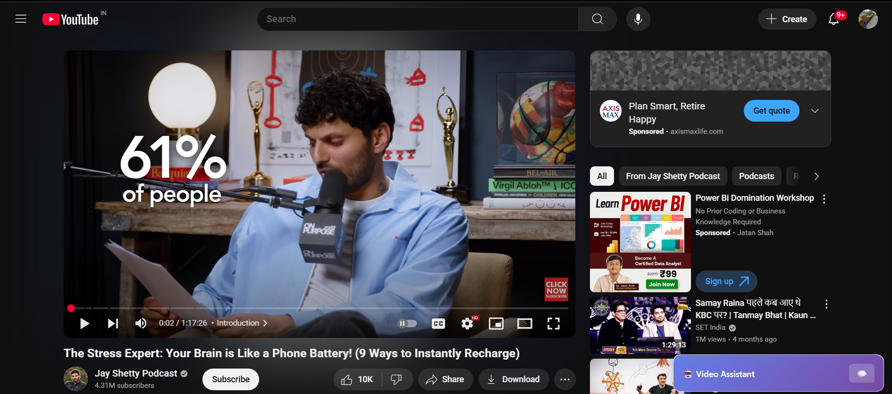
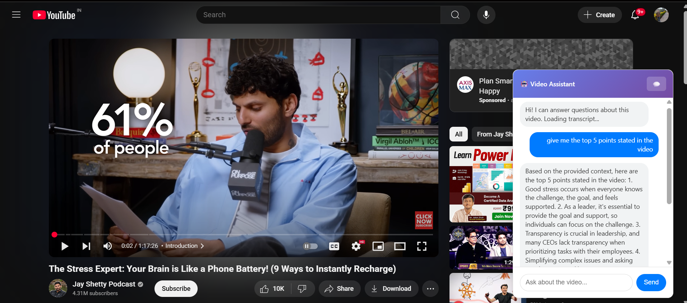

# 🎬🤖 YouTube Chatbot Chrome Extension

This Chrome Extension brings an intelligent AI chatbot directly onto YouTube, powered by **LangChain**, **Groq/OpenAI**, and **RAG (Retrieval-Augmented Generation)**. Ask context-aware questions about any YouTube video — and get smart, transcript-informed answers in real time.

---

## 🚀 Features

- 💬 **Chat directly on YouTube pages**
- 🧠 **RAG-powered answers** using LangChain with Groq or OpenAI LLMs
- 📄 **Transcripts & video metadata** are automatically retrieved and passed to the model
- ⚡ Fast, local vector search using **ChromaDB**
  
  

---

## Folders
- `/extension` — Chrome Extension
- `/backend` — Python FastAPI server with LangChain

## To Run
1. Clone this repo
2. Install backend dependencies
3. Start the backend
4. Load `/extension` as an unpacked extension in Chrome

## Tech Stack
- LangChain + OpenAI
- FastAPI
- Chrome Extension API
